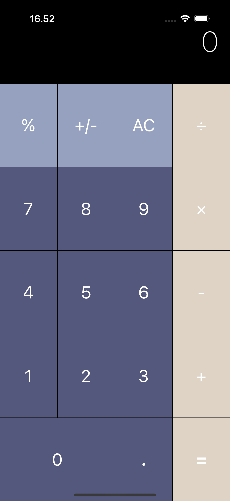
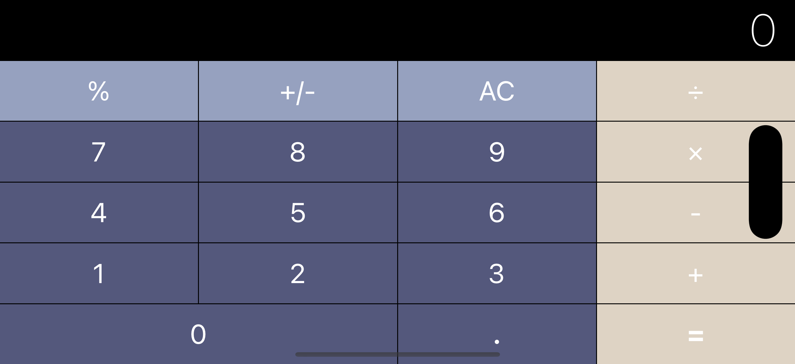

# 🧮 Calculator

## 📘 About This Project

This calculator project was built as part of my iOS development journey through *The Complete iOS App Development Bootcamp* by Angela Yu on Udemy. The primary focus of this project is mastering Auto Layout and building responsive user interfaces that adapt to different device orientations and screen sizes.

## 🧠 Key Concepts Practiced

During the development of this app, I applied several important iOS layout techniques:

* Using **Auto Layout** to make UI flexible and responsive  
* Working with **Size Classes** for orientation-based layouts  
* Setting **Constraints with Safe Areas**  
* Utilizing **Stack Views** for consistent element distribution  
* **Aligning and pinning UI elements**  
* **Nesting Containers and Subviews** for better layout management  

## ⚙️ Functional Implementation (Working App)

The calculator UI is now fully functional, complete with input handling and calculation logic. Here’s what has been implemented:

* Implemented all number and operator buttons with `IBAction` functions  
* Added logic for basic arithmetic operations: `+`, `-`, `×`, `÷`, `=`, `.`  
* Included additional functions: `AC`, `%`, and `+/-`  
* Used `UILabel` to display input and results dynamically  
* Applied logic to handle multi-digit inputs and decimal points  
* Ensured error handling for divide-by-zero cases  
* Formatted results to remove trailing `.0` if the result is an integer  
* Connected all `IBOutlet` and `IBAction` elements properly in storyboard  

## 📱 App Interface

The calculator interface is designed to dynamically adapt between portrait and landscape modes using stack views and layout constraints.

### 📲 Portrait Mode

### 🌄 Landscape Mode

## 🎓 What I Learned

* Creating adaptive layouts that follow platform guidelines  
* Debugging and adjusting conflicting constraints  
* Making interfaces that are usable and visually consistent across orientations  
* Handling spacing and proportions with layout priorities  
* Using nested stack views effectively  

## ✅ Conclusion

This project sharpened my skills in iOS UI development and taught me how to think in terms of responsive design. Building the calculator from scratch without hardcoding layouts was a rewarding challenge, and it gave me confidence to build more complex and scalable interfaces in the future.
